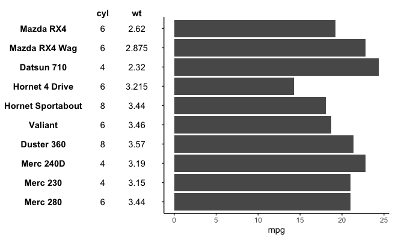

# simplePlotTable

<!-- badges: start -->
<!-- badges: end -->

This package provides a way of drawing a table with ggplot2, using `geom_text`, only.
The main purpose is to make tables easy to align using e.g. patchwork or cowplot and use them as axis labels.
I want to keep styling options to a minimum (i.e. aesthetics available to `geom_text`),
so no further options are planned.
However, you can add additional elements to the table, as it is a simple plot with continuous coordinates.

## Installation

```{r}
devtools::install_github("Schmitzi/simplePlotTable")
```

## Examples

### Basic Output
```{r}
library(simplePlotTable)
library(ggplot2)

# Using mtcars for demonstration
data <- mtcars[1:10, c("wt", "mpg", "cyl")]

# Create object
tbl <- new_SimplePlotTable(data[, c("cyl", "wt")])

tbl_plot <- autoplot(tbl)
tbl_plot
```


### Styling
```{r}
library(magrittr)

tbl %>%
  set_style(hjust=1) %>%
  set_style(cols=2, fontface="italic") %>%
  set_style(cols=1, rows=4, colour="red") %>% 
  set_column_header_style(face="bold") %>% 
  set_row_header_style(face="italic", hjust=1) %>% 
  autoplot()
```


### Alignment to Other Plots
```{r}
library(patchwork)

# Adding factor with cars for ggplot, preserves order
data$car <- factor(rownames(data), levels=rownames(data))

mpg_plot <- ggplot(data) +
  geom_col(aes(x=car, y=mpg)) +
  theme_classic() + 
  theme(axis.text.y = element_blank(), axis.title.y=element_blank()) +
  coord_flip()
  
(tbl_plot | mpg_plot) + plot_layout(widths=c(1,3))
```


## Why?
I found existing solutions, like gridExtra's tableGrob, too annoying to use,
especially when I tried to align them to plots.
There are definitely a lot more customizable options out there.
This packages goal is _not_ to be a full-fledged system for table creation in ggplot.
It is supposed to make it as easy as possible to draw a simple table in ggplot2 and align it to an axis.
